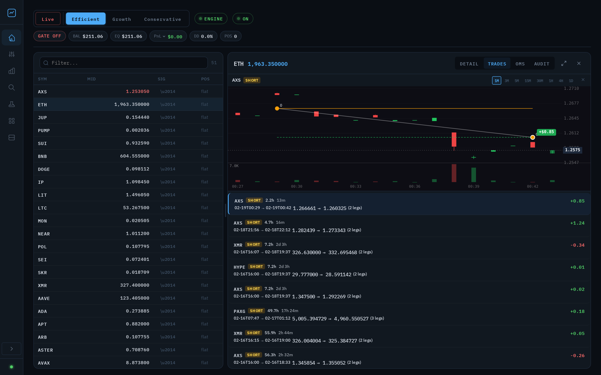
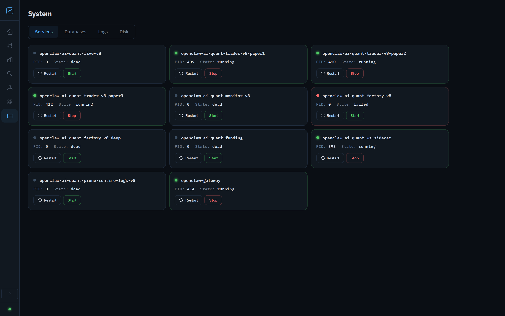
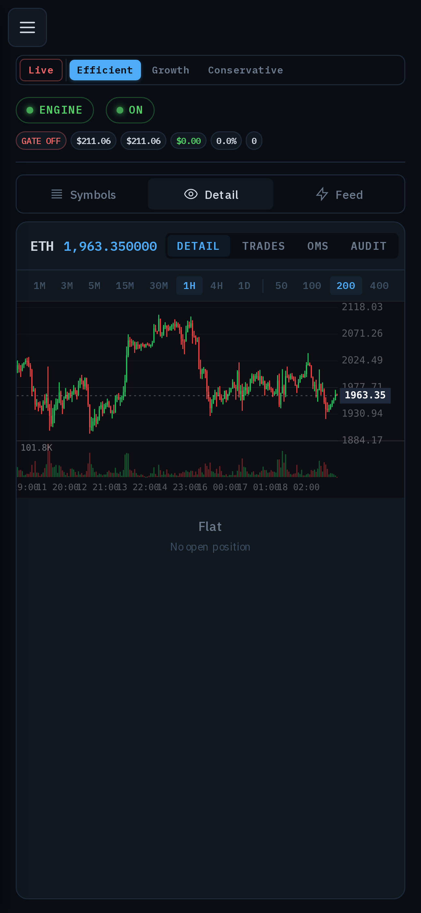
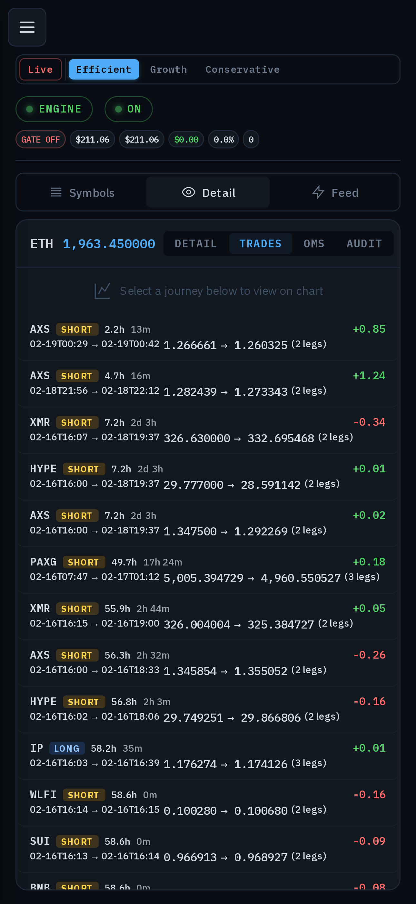
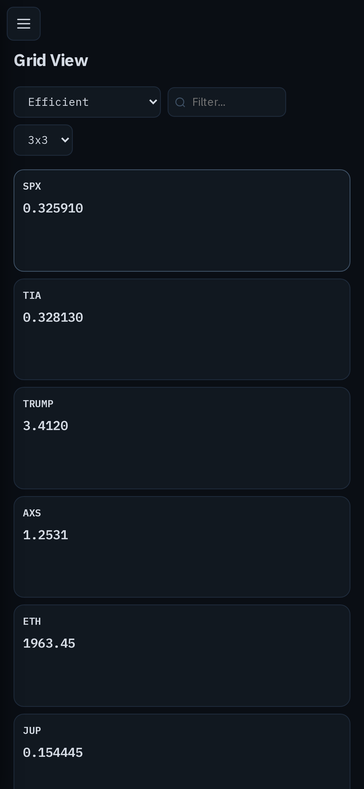

# openclaw-crypto-ai-quant

AI-powered crypto perpetual futures trading engine for [Hyperliquid DEX](https://hyperliquid.xyz), with a high-performance Rust backtester featuring CPU and CUDA GPU acceleration.

## Screenshots

### Trade Dashboard
Candlestick charts with trade overlays, live mid-prices, and full trade journal with PnL.



### Service Management
One-click start/stop/restart for all systemd services with live status indicators.



### Mobile
Fully responsive — monitor trades, prices, and services from your phone.

<p align="center">
  
  &nbsp;&nbsp;
  
  &nbsp;&nbsp;
  
</p>

## Architecture

```
                    ┌─────────────┐
                    │  Hyperliquid │
                    │     DEX      │
                    └──────┬───────┘
                           │ WS + REST
                    ┌──────▼───────┐
                    │  WS Sidecar  │  (Rust)
                    │ (market data) │
                    └──────┬───────┘
                           │ Unix socket
              ┌────────────▼────────────┐
              │     Unified Engine      │
              │       (engine/)         │
              ├──────────┬──────────────┤
              │  Paper   │    Live      │
              │ Trader   │   Trader     │
              ├──────────┴──────────────┤
              │   Kernel Orchestrator   │
              │  (Rust bt-runtime/PyO3) │
              ├─────────────────────────┤
              │     Risk Manager        │
              ├─────────────────────────┤
              │   Order Mgmt System     │
              └────────────┬────────────┘
                           │
         ┌─────────────────┼─────────────────┐
         │                 │                 │
   ┌─────▼─────┐   ┌──────▼──────┐   ┌──────▼──────┐
   │  Monitor   │   │  Hub (Rust  │   │  Alerting   │
   │ Dashboard  │   │  + Svelte)  │   │  (Discord/  │
   │ (Python)   │   │             │   │  Telegram)  │
   └────────────┘   └─────────────┘   └─────────────┘

Standalone:
   ┌──────────────────────────────────────────────┐
   │          Rust Backtester (CPU / CUDA GPU)     │
   │  bt-core · bt-signals · bt-gpu · risk-core   │
   └──────────────────────────────────────────────┘

Nightly pipeline:
   ┌──────────────────────────────────────────────┐
   │  Strategy Factory (factory_run.py / cycle)    │
   │  sweep → validate → deploy → paper → promote  │
   └──────────────────────────────────────────────┘
```

See [docs/ARCHITECTURE.md](docs/ARCHITECTURE.md) for detailed component descriptions, data flow, and project structure.

## Highlights

| | |
|---|---|
| **Trading** | Unified paper / dry_live / live daemon with hot-reloadable YAML config |
| **Strategy** | Mei Alpha v1 — multi-indicator, confidence-ranked entries, ATR-based risk |
| **Decision Kernel** | Shared Rust signal logic (`bt-signals`) across backtester, GPU sweep, and live trading via PyO3 bridge |
| **Backtester** | CPU replay + CUDA GPU sweeps (60K param combos in ~3 s) + TPE Bayesian optimisation |
| **Factory** | Nightly pipeline: sweep → validate → deploy → paper → promote → live ramp (25% → 50% → 100%) |
| **Risk** | Daily loss limits, drawdown kill-switch, rate limiting, exposure caps, slippage guard |
| **Monitoring** | Python dashboard, Rust + Svelte hub, Discord / Telegram alerting |
| **Data** | Rust WS sidecar streams Hyperliquid market data over Unix socket; maintains candle DBs |

## Quick Start

```bash
git clone https://github.com/fol2/openclaw-crypto-ai-quant.git
cd openclaw-crypto-ai-quant

# Python >=3.12 + uv required
uv sync --dev
source .venv/bin/activate

# Configure (paper mode needs no secrets)
cp .env.example .env

# Run paper trader
AI_QUANT_MODE=paper python -m engine.daemon
```

For live trading, copy secrets outside the repo and set safety flags:

```bash
mkdir -p ~/.config/openclaw
cp config/secrets.json.example ~/.config/openclaw/ai-quant-secrets.json
chmod 600 ~/.config/openclaw/ai-quant-secrets.json
# Edit .env: AI_QUANT_MODE=live, AI_QUANT_LIVE_ENABLE=1, AI_QUANT_LIVE_CONFIRM=...
```

## Backtester

```bash
# Build (CPU)
python3 tools/build_mei_backtester.py

# Build (GPU, requires CUDA)
python3 tools/build_mei_backtester.py --gpu

# Single replay
mei-backtester replay --candles-db candles_dbs/candles_1h.db

# Parameter sweep
mei-backtester sweep --sweep-config sweeps/smoke.yaml

# GPU sweep + TPE
mei-backtester sweep --gpu --tpe --tpe-trials 5000 --sweep-spec sweep.yaml
```

See [backtester/README.md](backtester/README.md) for candle DB partitioning, universe filtering, GPU parity lanes, and the full config deploy pipeline.

## Configuration

Strategy parameters live in `config/strategy_overrides.yaml` and **hot-reload at runtime** (no restart needed). Merge order:

```
code defaults ← global YAML ← per-symbol YAML ← live YAML
```

Key sections: `trade` (sizing, SL/TP, pyramiding), `market_regime` (breadth, auto-reverse), `filters` (entry gates), `indicators` (EMA, ADX, BB windows), `engine` (intervals).

See `.env.example` for all environment variables and safety controls.

## Deployment

Systemd user service templates in `systemd/`:

| Service | Purpose |
|---------|---------|
| `openclaw-ai-quant-trader` | Paper trading daemon |
| `openclaw-ai-quant-live` | Live trading daemon |
| `openclaw-ai-quant-ws-sidecar` | Market data WebSocket sidecar |
| `openclaw-ai-quant-monitor` | Real-time monitoring dashboard |
| `openclaw-ai-quant-factory` | Nightly strategy sweep (timer) |

```bash
cp systemd/<template>.example ~/.config/systemd/user/<unit-name>
systemctl --user daemon-reload
systemctl --user enable --now <unit-name>
```

See [docs/runbook.md](docs/runbook.md) for emergency stop, rollback, and diagnostics procedures.

## Development

```bash
# Python
uv sync --dev
uv run pytest
uv run ruff check engine strategy exchange live tools tests monitor
uv run ruff format engine strategy exchange live tools tests monitor

# Rust (backtester / ws_sidecar / hub)
cargo build --release
cargo test && cargo fmt --check && cargo clippy -- -D warnings
```

Version is governed by `VERSION` (single source of truth). See [docs/release_process.md](docs/release_process.md).

## Documentation

| Document | Description |
|----------|-------------|
| [docs/ARCHITECTURE.md](docs/ARCHITECTURE.md) | System design, components, and project structure |
| [docs/DEVELOPMENT.md](docs/DEVELOPMENT.md) | Development setup and guidelines |
| [docs/CONTRIBUTING.md](docs/CONTRIBUTING.md) | Contribution guidelines |
| [docs/runbook.md](docs/runbook.md) | Operations runbook (emergency stop, rollback, diagnostics) |
| [docs/strategy_lifecycle.md](docs/strategy_lifecycle.md) | Config state machine (candidate → live) |
| [docs/success_metrics.md](docs/success_metrics.md) | Risk limits and promotion criteria |
| [docs/release_process.md](docs/release_process.md) | Version governance and tag-driven releases |
| [backtester/README.md](backtester/README.md) | Backtester documentation |
| [monitor/README.md](monitor/README.md) | Dashboard documentation |
| [engine/README.md](engine/README.md) | Engine internals |

## License

MIT
