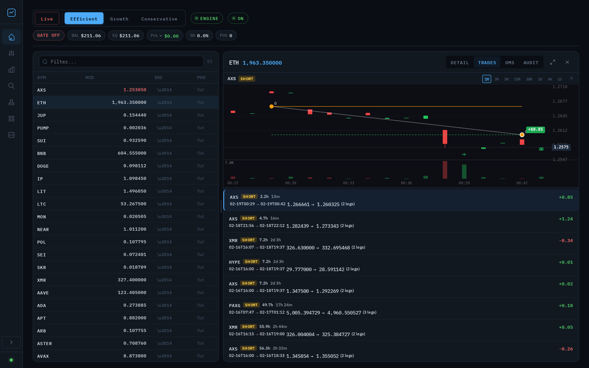
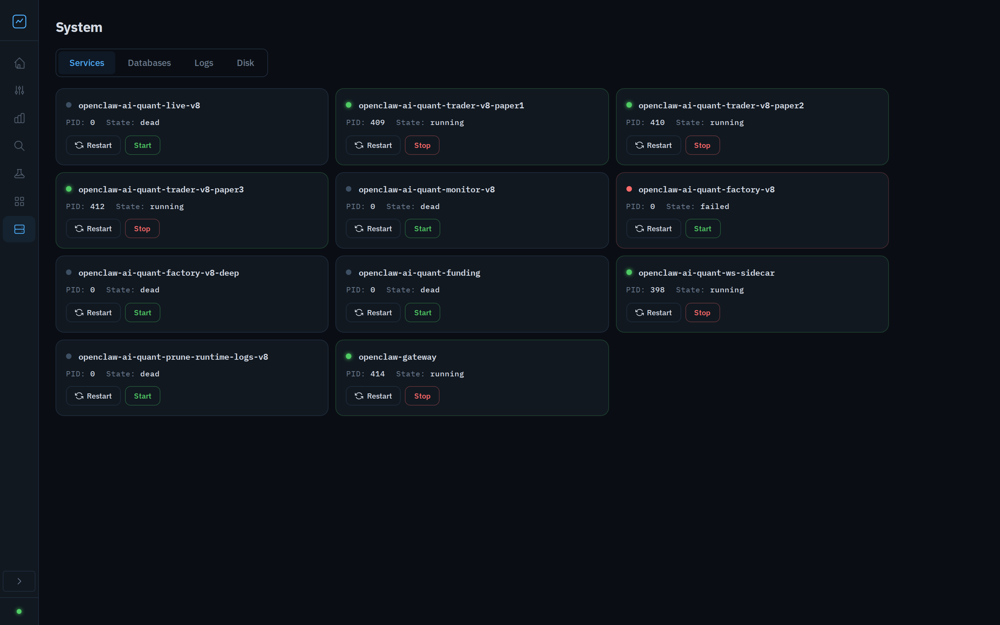
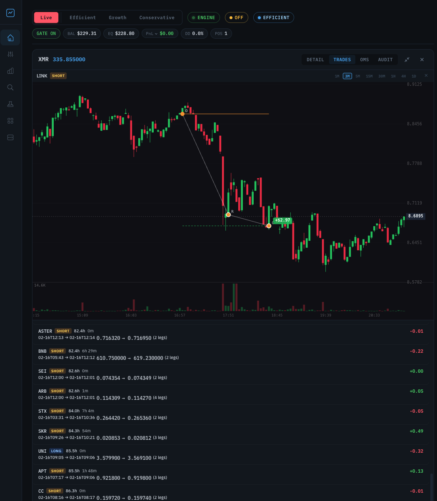
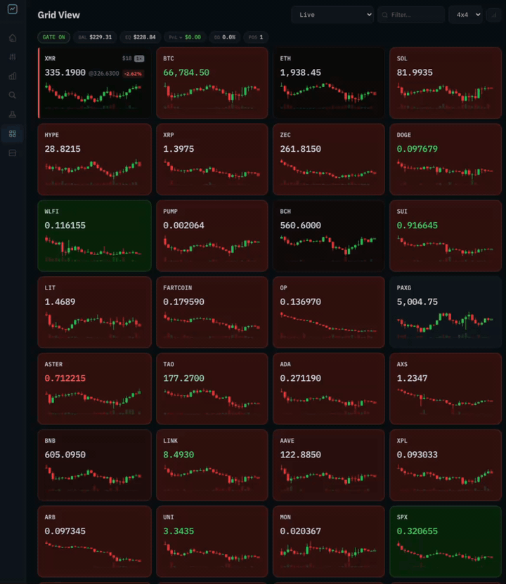

# openclaw-crypto-ai-quant

AI-powered crypto perpetual futures trading engine for [Hyperliquid DEX](https://hyperliquid.xyz), with a high-performance Rust backtester featuring CPU and CUDA GPU acceleration.

The repository is now also shipping the first `aiq-runtime` foundation slice for
the long-term Rust-only daemon migration. See
[docs/programmes/rust-runtime-foundation.md](docs/programmes/rust-runtime-foundation.md)
for the active programme contract.

Rust now also has a first paper bootstrap/restore shell via
`aiq-runtime paper doctor`, while Python paper execution remains frozen as the
legacy runtime path until full Rust paper execution lands. Rust currently owns
four paper-facing shells (`paper doctor`, `paper run-once`, `paper cycle`, and
`paper loop`), with one paired opt-in orchestration wrapper tracked alongside
them: `paper daemon`. `paper cycle` still runs one explicit multi-symbol cycle
with `--step-close-ts-ms` and a rerun guard, `paper loop` still resumes from
`runtime_cycle_steps` to catch up unapplied bar-close steps, and `paper daemon`
now owns the long-running outer scheduler for the same `paper cycle` write
contract. `paper loop` only loads an optional `--symbols-file` once at
start-up; `paper daemon --watch-symbols-file` is the opt-in Rust surface that
can watch for later symbols-file changes, retain the last good manifest on bad
or runtime-invalid malformed reloads, and keep running without a restart.
Rust also now ships a read-only `paper manifest` surface that resolves the
current daemon service/env contract into a deterministic Rust launch plan
before any systemd cutover. The manifest now also reports whether the current
lane would cold-bootstrap, resume from prior `runtime_cycle_steps`, idle
caught up, or fail closed until a bootstrap step is supplied, and it resolves
the daemon `status_path` that later service supervision can watch. Python paper
execution remains the active production path, so this does not claim paper
cutover.
Rust now also ships a read-only `paper status` surface that combines that
launch contract with the persisted daemon status JSON so operators can see
whether the current Rust lane is merely launch-ready, actively running, stale,
stopped, or in need of a restart because the live daemon contract drifted from
the current config/env plan.

## Screenshots

### Trade Dashboard
Candlestick charts with trade overlays, live mid-prices, and full trade journal with PnL.



### Service Management
One-click start/stop/restart for all systemd services with live status indicators.



### Trades
Trade journal with candlestick chart overlays, entry/exit markers, and per-trade PnL.



### Grid View
Live prices, candlestick sparklines, positions, and PnL across your entire watchlist.



## Architecture

<p align="center">
  
</p>

See [docs/ARCHITECTURE.md](docs/ARCHITECTURE.md) for detailed component descriptions, data flow, and project structure.

## Highlights

| | |
|---|---|
| **Trading** | Unified paper / dry_live / live daemon with hot-reloadable YAML config |
| **Strategy** | Mei Alpha v1 — multi-indicator, confidence-ranked entries, ATR-based risk |
| **Decision Kernel** | Shared Rust signal logic (`bt-signals`) across backtester, GPU sweep, and live trading via PyO3 bridge |
| **Backtester** | CPU replay + CUDA GPU sweeps (60K param combos in ~3 s) + TPE Bayesian optimisation |
| **Factory** | Nightly pipeline: sweep → validate → deploy → paper → promote → live ramp (25% → 50% → 100%) |
| **Risk** | Daily loss limits, drawdown kill-switch, rate limiting, exposure caps, slippage guard |
| **Monitoring** | Python dashboard, Rust + Svelte hub, Discord / Telegram alerting |
| **Data** | Rust WS sidecar streams Hyperliquid market data over Unix socket; maintains candle DBs |

## Quick Start

```bash
git clone https://github.com/fol2/openclaw-crypto-ai-quant.git
cd openclaw-crypto-ai-quant

# Python >=3.12 + uv required
uv sync --dev
source .venv/bin/activate

# Configure (paper mode needs no secrets)
cp .env.example .env

# Run paper trader
AI_QUANT_MODE=paper python -m engine.daemon
```

For live trading, copy secrets outside the repo and set safety flags:

```bash
mkdir -p ~/.config/openclaw
cp config/secrets.json.example ~/.config/openclaw/ai-quant-secrets.json
chmod 600 ~/.config/openclaw/ai-quant-secrets.json
# Edit .env: AI_QUANT_MODE=live, AI_QUANT_LIVE_ENABLE=1, AI_QUANT_LIVE_CONFIRM=...
```

## Backtester

```bash
# Build (CPU)
python3 tools/build_mei_backtester.py

# Build (GPU, requires CUDA)
python3 tools/build_mei_backtester.py --gpu

# Single replay
mei-backtester replay --candles-db candles_dbs/candles_1h.db

# Parameter sweep
mei-backtester sweep --sweep-config sweeps/smoke.yaml

# GPU sweep + TPE
mei-backtester sweep --gpu --tpe --tpe-trials 5000 --sweep-spec sweep.yaml
```

See [backtester/README.md](backtester/README.md) for candle DB partitioning, universe filtering, GPU parity lanes, and the full config deploy pipeline.

## Configuration

Strategy parameters live in `config/strategy_overrides.yaml` and **hot-reload at runtime** (no restart needed). Merge order:

```
code defaults ← global YAML ← per-symbol YAML ← live YAML
```

Key sections: `trade` (sizing, SL/TP, pyramiding), `market_regime` (breadth, auto-reverse), `filters` (entry gates), `indicators` (EMA, ADX, BB windows), `engine` (intervals).

See `.env.example` for all environment variables and safety controls.

## Deployment

Systemd user service templates in `systemd/`:

| Service | Purpose |
|---------|---------|
| `openclaw-ai-quant-trader-v8-paper1` | Primary paper trading daemon |
| `openclaw-ai-quant-trader-v8-paper2` | Candidate paper trading daemon |
| `openclaw-ai-quant-trader-v8-paper3` | Candidate paper trading daemon |
| `openclaw-ai-quant-live-v8` | Live trading daemon |
| `openclaw-ai-quant-ws-sidecar` | Market data WebSocket sidecar |
| `openclaw-ai-quant-monitor` | Real-time monitoring dashboard |
| `openclaw-ai-quant-factory-v8` | Nightly strategy sweep (timer) |

```bash
cp systemd/<template>.example ~/.config/systemd/user/<unit-name>
systemctl --user daemon-reload
systemctl --user enable --now <unit-name>
```

See [docs/runbook.md](docs/runbook.md) for emergency stop, rollback, and diagnostics procedures.

## Development

```bash
# Python
uv sync --dev
uv run pytest
uv run ruff check engine strategy exchange live tools tests monitor
uv run ruff format engine strategy exchange live tools tests monitor

# Rust (backtester workspace)
cargo build --release --manifest-path backtester/Cargo.toml
cargo test --manifest-path backtester/Cargo.toml

# Rust (root workspace: runtime foundation)
cargo build --workspace
cargo test --workspace

# Rust runtime foundation
cargo test -p aiq-runtime-core
cargo run -p aiq-runtime -- pipeline --json
cargo run -p aiq-runtime -- snapshot validate --path /tmp/paper_init_state_v2.json --json
cargo run -p aiq-runtime -- snapshot seed-paper --snapshot /tmp/paper_init_state_v2.json --target-db trading_engine.db --strict-replace --json
cargo run -p aiq-runtime -- paper doctor --db trading_engine.db --json
cargo run -p aiq-runtime -- paper run-once --db trading_engine.db --candles-db candles_dbs/candles_30m.db --target-symbol ETH --exported-at-ms 1772676900000 --dry-run --json
cargo run -p aiq-runtime -- paper cycle --db trading_engine.db --candles-db candles_dbs/candles_30m.db --symbols ETH,SOL --step-close-ts-ms 1773426000000 --exported-at-ms 1772676900000 --dry-run --json
cargo run -p aiq-runtime -- paper loop --db trading_engine.db --candles-db candles_dbs/candles_30m.db --symbols ETH,SOL --start-step-close-ts-ms 1773424200000 --max-steps 2 --dry-run --json
```

Version is governed by `VERSION` (single source of truth). See [docs/release_process.md](docs/release_process.md).

## Documentation

| Document | Description |
|----------|-------------|
| [docs/ARCHITECTURE.md](docs/ARCHITECTURE.md) | System design, components, and project structure |
| [docs/DEVELOPMENT.md](docs/DEVELOPMENT.md) | Development setup and guidelines |
| [docs/CONTRIBUTING.md](docs/CONTRIBUTING.md) | Contribution guidelines |
| [docs/runbook.md](docs/runbook.md) | Operations runbook (emergency stop, rollback, diagnostics) |
| [docs/strategy_lifecycle.md](docs/strategy_lifecycle.md) | Config state machine (candidate → live) |
| [docs/success_metrics.md](docs/success_metrics.md) | Risk limits and promotion criteria |
| [docs/release_process.md](docs/release_process.md) | Version governance and tag-driven releases |
| [docs/adr/ADR-0001-rust-runtime-foundation.md](docs/adr/ADR-0001-rust-runtime-foundation.md) | Rust runtime foundation decision record |
| [docs/programmes/rust-runtime-foundation.md](docs/programmes/rust-runtime-foundation.md) | Rust runtime foundation programme and phase order |
| [docs/teams/docs-team-charter.md](docs/teams/docs-team-charter.md) | Standing documentation team contract for migration waves |
| [docs/housekeeping/legacy-runtime-ledger.md](docs/housekeeping/legacy-runtime-ledger.md) | Legacy runtime surfaces queued for quarantine and removal |
| [docs/state_sync/init_state_v2_contract.md](docs/state_sync/init_state_v2_contract.md) | Canonical continuation contract for Rust-owned snapshots |
| [docs/validation/rust-runtime-foundation.md](docs/validation/rust-runtime-foundation.md) | Validation matrix for the runtime foundation slice |
| [backtester/README.md](backtester/README.md) | Backtester documentation |
| [monitor/README.md](monitor/README.md) | Dashboard documentation |
| [engine/README.md](engine/README.md) | Engine internals |

## License

MIT
